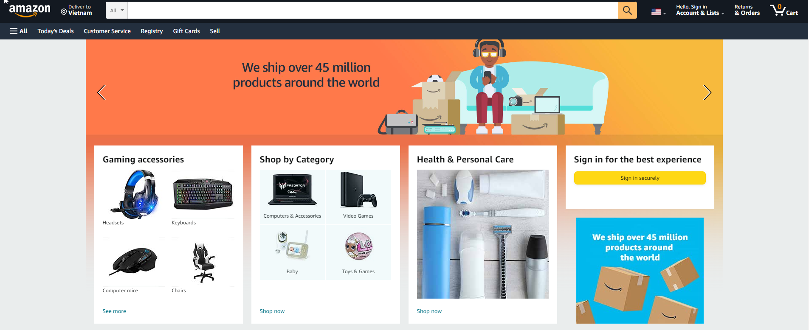

.. _create_amazon_account:

Create an account on Amazon
===========================

To log in to AWS Cloud Quest, you must use an Amazon e-commerce account (if you don’t have one, you can create one by following these steps).

Steps to create an Amazon account
---------------------------------

#. Open the app or go to the official website Amazon.

#. Select **Create a new Amazon account**.

#. Enter **User name**.
#. Enter **Mobile number and Email address to connect**.
#. Enter **Password**.
#. Enter **Re-enter password**.
#. Next, select **Verify**.

#. A new page appears, enter the six-digit OTP in the space provided.
#. Select **Create your Amazon account**.

.. note::

   Before creating an account, make sure you are using a valid mobile number because adding a mobile number is required to create a new account on Amazon.in, while adding an email only is optional.

You can sign in to Your Account at any time by clicking **Your Account** at the top of each page. You just need to enter the same Mobile number or Email address and Password to access your account.
