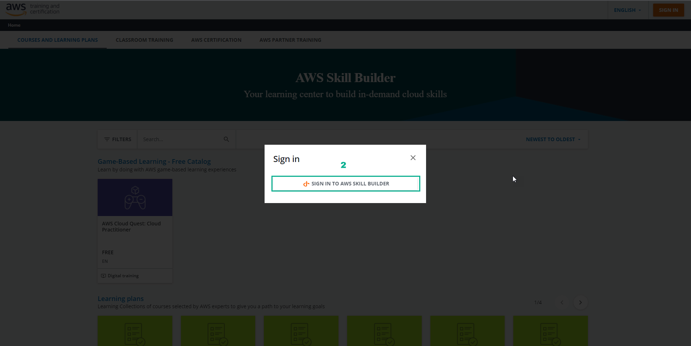
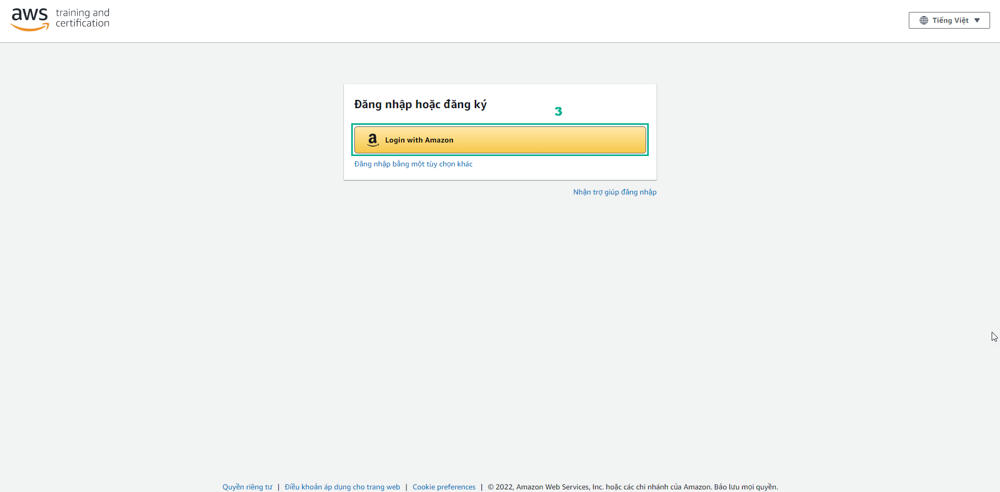
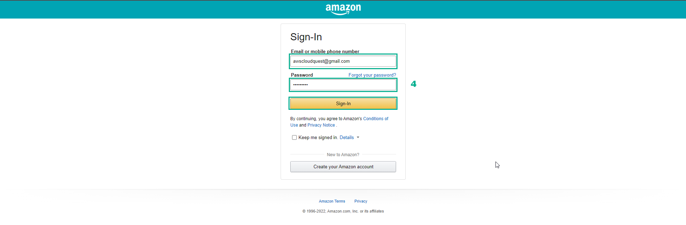
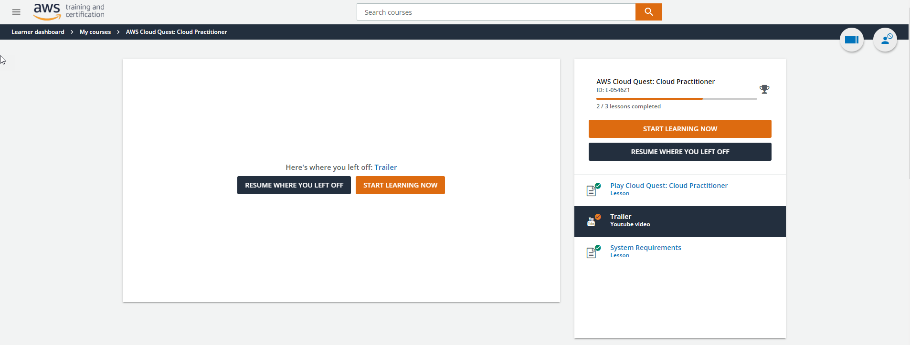

.. _login_amazon_account:

Login to Amazon account
=======================

There are 4 options for logging into AWS Training and Certification:

* Login with Amazon
* AWS Partner
* Organization SSO
* Amazon Employee

This lab uses the Login with Amazon login method.

Steps to sign in to AWS Training and Certification
--------------------------------------------------

#. Go to AWS Skill Builder
#. Select **SIGN IN TO AWS SKILL BUILDER**

#. The AWS Training and Certification login interface appears, select **Login with Amazon**

#. Amazon login page appears:
   Enter **Email or mobile phone number**
   Enter **Password**
   Then, select **Sign-in**

#. After logging in, the AWS Training and Certification interface appears.

.. note::

#.  During the login process, as shown in the picture, select **Allow**

